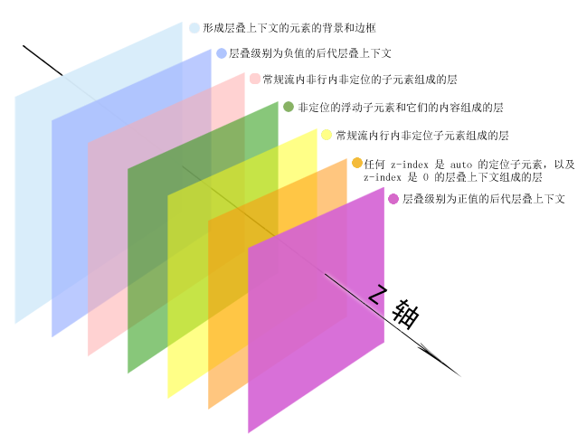
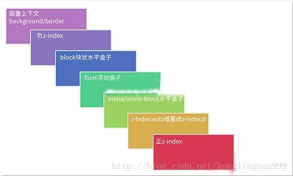

title: javaScript中的内置对象
date: 2014-01-21 23:33:02
tags: 写作
categories:

# javaScript中的内置对象
## 概念：
- javascript已经预先给我们定义好了很多对象，这些对象可以直接去使用，可以帮我们完成一些常用的功能；
### 内置对象的分类：
## Math 对象：
- 常用属性：
   > Math.PI：获取π的值;

- 常用方法：
    > Math.max():获取最大值;
    <br>
	> Math.min():获取最小值;
    <br>
	> Math.ceil()：向上取整;
    <br>
	> Math.floor(): 向下取整;
    <br>
	> Math.round():四舍五入;
    <br>
	> Math.random():返回0-1之间的一个随机数，[0,1) 能取到0，取不到1;
    <br>
	> Math.abs():取绝对值;
    <br>
	> Math.pow(num,power):求num的power次幂;
    <br>
	> Math.sqrt(num):对num开平方;


## Date对象：

- 创建一个日期对象：
```js
    //使用构造函数创建一个日期对象
    var date = new Date(); //不传参数表示当前时间

    //构造函数可以接受三种参数：
    "2016-07-25 10:14:09:991"  字符串的日期格式
	2005，9，1日期的每一部分，注意月份是从0开始的
	表示日期的毫秒形式1128096000000

```


- 日期格式化：
    - 日期转换成字符串：
```js
var date = new date();
console.log(date.toString());//直接打印date，默认调用toString方法
console.log(date.toLocaleString());
console.log(date.toDateString());
console.log(date.toLocaleDateString());
console.log(date.toTimeString());
console.log(date.toLocaleTimeString());
```


  - 日期转换成毫秒：
```js


``` 


